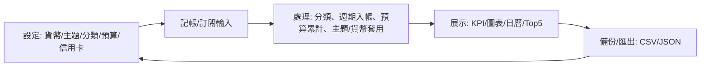

# SmartFinance (PWA)

一個 **local-first** 嘅記帳 PWA：集記帳 / 訂閱自動入帳 / 預算 / 報表 / 信用卡管理於一身。

> 目前版本以 **瀏覽器本機儲存（localStorage）** 作為資料來源，支援 **CSV/JSON 匯出/匯入** 做備份。

---

## App 核心與價值
- 一站式：記帳、訂閱、預算、報表、信用卡管理
- 自動化：訂閱到期自動入帳、預算進度/超標提示、信用卡年費/回贈管理
- 視覺化：KPI、趨勢、分類統計、Top 5
- 客製化：多貨幣、多主題、分類/標籤自由組合
- 備份：CSV/JSON 匯出/匯入（local-first）

## App 解決的問題
- 分散的收支、訂閱扣款、預算管控與報表難以統整
- 手動記錄繁瑣；換機或瀏覽器資料被清除有遺失風險
- 缺少可視化與提醒，難以保持財務自律

## 主要使用流程（簡潔步驟）
- 設定：選擇貨幣與主題
- 記帳：輸入金額/分類/標籤/備註 → 儲存
- 訂閱：設定週期/扣款日 → 到期自動入帳
- 信用卡：設定每張卡「截數日 / 繳費日」→ 於「信用卡週期」輸入本期應繳 → 繳費後標記已繳費；需要時手動建立/切換下一期，亦可查閱上一期
- 檢視：
  - 月曆：每日收支總覽
  - 報表：KPI、趨勢、分類、Top 5
- 管理：分類 / 預算 / 信用卡 / 信用卡週期 → 設定與提醒
- 備份：CSV/JSON 匯出/匯入

## 使用者旅程 / 邏輯
- Journey：設定 → 記帳/訂閱 → 觀察統計 → 調整預算/分類 → 備份
- 模組連結：Settings(貨幣/主題/分類/預算/信用卡) → Transactions/Subscriptions → Calendar/Reports → Backup(匯出/匯入)

### Mermaid 流程示意


---

## 技術棧
- React + TypeScript
- Vite
- React Router（HashRouter）
- Recharts
- Tailwind CSS
- Lucide React

## 工程 / 品質保證
- GitHub Actions CI：每次 push / PR 會自動跑 `npm ci` + `npm run build`（防止壞 build 入 main）
- localStorage schema version：`smartfinance_schema_version`（為將來資料結構升級/migration 做準備）
- App 版本號：設定頁會顯示版本（取自 `package.json` version；目前 **1.0.3**）
- 日期處理：已統一使用本地 `YYYY-MM-DD`（避免 UTC offset 造成日期偏移）
- 首次使用：只會首次導到 `/welcome`，之後預設進入 Dashboard

## 信用卡週期 / 提醒（本機）
- 每張信用卡可設定：截數日、繳費日，以及提醒開關。
- 新增「信用卡週期」頁：
  - 截數後 + 1 日：提醒輸入本期應繳金額（透過 iOS 行事曆 .ics）
  - 輸入應繳金額後會即時反映於列表
  - 繳費後可一鍵「已繳費」（只標記當期為已繳）
  - 如要下一期：用「建立下一期」手動建立並切換
  - 支援週期下拉選擇（YYYY-MM）+ 上/下一期，方便查閱歷史週期
  - 「取消已繳費」只對 closed（已繳）週期可用
  - （含防呆：避免重複繳費/未輸入金額誤按）
- 年費提醒：於年費月份 1 號加入提醒（透過 iOS 行事曆 .ics；年費為 0 則不提醒）
- 資料儲存：信用卡週期會儲存在 localStorage `smartfinance_creditcard_cycles`

## 開發 / 預覽
```bash
npm install
npm run dev
```

Build & preview：
```bash
npm run build
npm run preview
```

### VSCode「Go Live / Live Server」
- 先 `npm run build`
- 本專案已內建 `.vscode/settings.json`：Go Live 會以 `dist/` 為網站根目錄（避免直接打開原始 `index.html` 造成白畫面）

### Service Worker / PWA 注意
- `npm run build` + 靜態部署時會啟用 service worker（PWA）。
- 如果你見到「更新咗但畫面仲係舊版」：
  - Chrome DevTools → Application → Service Workers → **Unregister**
  - 或者 Clear site data / 刪 cache 再 refresh
